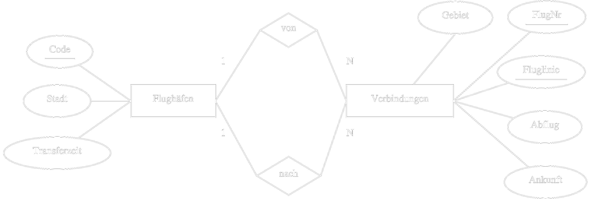

Funktionsweise anhand eines kleinen Beispiels (siehe "Weitere Übungsbeispiele inkl. Lösungen").
Einsatzbereich - welcher JOIN für welche Abfrage / bzw. Situation (ala Query gegeben, welcher JOIN wäre optimal inkl Begründung)


- ## Hausaufgabe 1
  - Gegeben sei die folgende SQL-Anfrage:
    ```sql
      select distinct a.PersNr , a.Name
        from Assistenten a , Studenten s , pruefen p
          where s.MatrNr = p.MatrNr
            and a.Boss = p.PersNr
            and s.Name = 'Jonas' ;
    ```
  - **1.** Geben Sie die kanonische Übersetzung dieser Anfrage in die relationale Algebra an. 

  - **2.** Verwenden Sie zur Darstellung des relationalen Algebraausdrucks die Baumdarstellung.
  
  - **3.** Optimieren Sie Ihren relationalen Algebraausdruck logisch. 
    > Gehen Sie dabei von realistischen Kardinalitäten fur die relevanten Relationen aus.

    Verwenden Sie hierfur die folgenden aus der Vorlesung bekannten Optimierungstechniken:
     - Aufbrechen von Selektionen
     - Verschieben von Selektionen nach “unten” im Plan
     - Zusammenfassen von Selektionen und Kreuzprodukten zu Joins
     - Bestimmung der Joinreihenfolge


---

- ## Hausaufgabe 2
  - Betrachten Sie die Anfrage: 
  ***"Finde alle Flüge von New-York nach Sydney mit einmaligem Umsteigen"***.
  - Dazu sei das nachfolgende (vereinfachte) ER-Diagramm eines Fluginformationssystems gegeben:
  
  <div align="center">
  
    |  |
    |:--------------------------------------------------------:|
  </div>
  
  - **1.** Geben Sie eine SQL-Query fur die oben genannte Anfrage an. 
    ```SQL
    SELECT DISTINCT v1.* , v2.*
      FROM 
          Flughäfen    f_start
        , Verbindungen v1
        , Verbindungen v2
        , Flughäfen    f_end
      WHERE f_start.Stadt = 'New York'
        AND   f_end.Stadt = 'Sydney'
        AND        v2.von = v1.nach
        AND       v2.nach = f_end.Code
        AND  f_start.Code = v1.von;
    ```
    ---

  - **2.** Führen Sie die kanonische Übersetzung des SQL-Statements in die  relationale Algebra durch.
  
    
    ---

  - **3.** Schätzen Sie die Relationsgrößen sinnvoll ab 
  
    ---

  - **4.** Transformieren Sie den kanonischen Operatorbaum aus Teilaufgabe 2 zur optimalen Form. 
    > Wie haben sich die Kosten dabei geändert? (Kosten = Anzahl der Zwischenergebnistupel)


---

<!--
- ## Hausaufgabe 4

Hausaufgabe 4
Gegeben sind die beiden Relationenausprägungen:
-->