<!-- -->
 ## Logische Optimierung

 
|  1  |  2  |  3  |  
|:---:|:---:|:---:|  
|  | |  |  
|**4**|**5**|**6**|  
|  |  |  |  

- **Erhaltene Ergebnisse im Vergleich:**

  
 |  **4** | **5** |  
 |:---:|:---:|  
 |  |  |  

