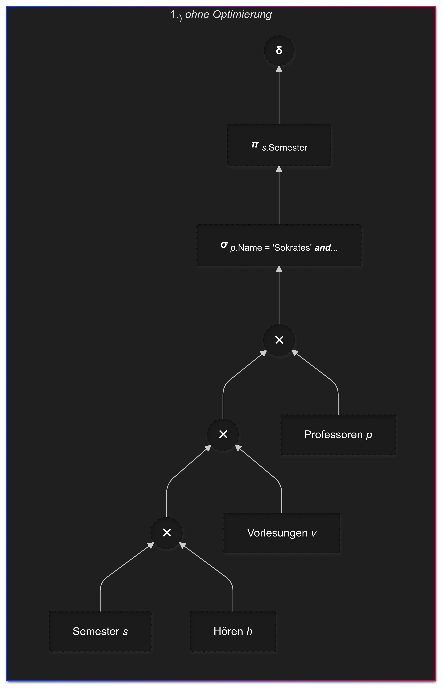
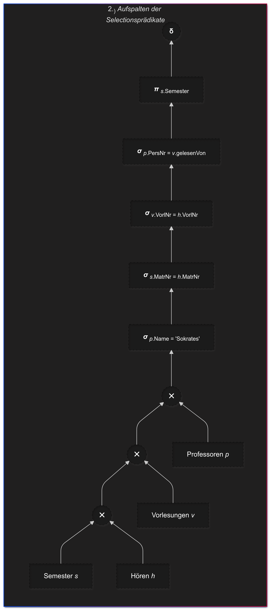
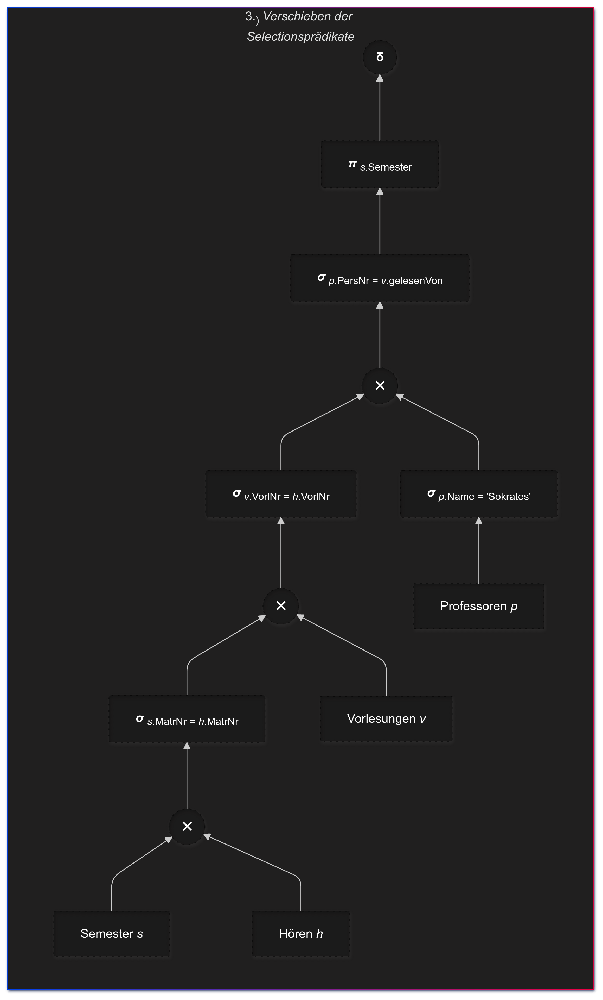
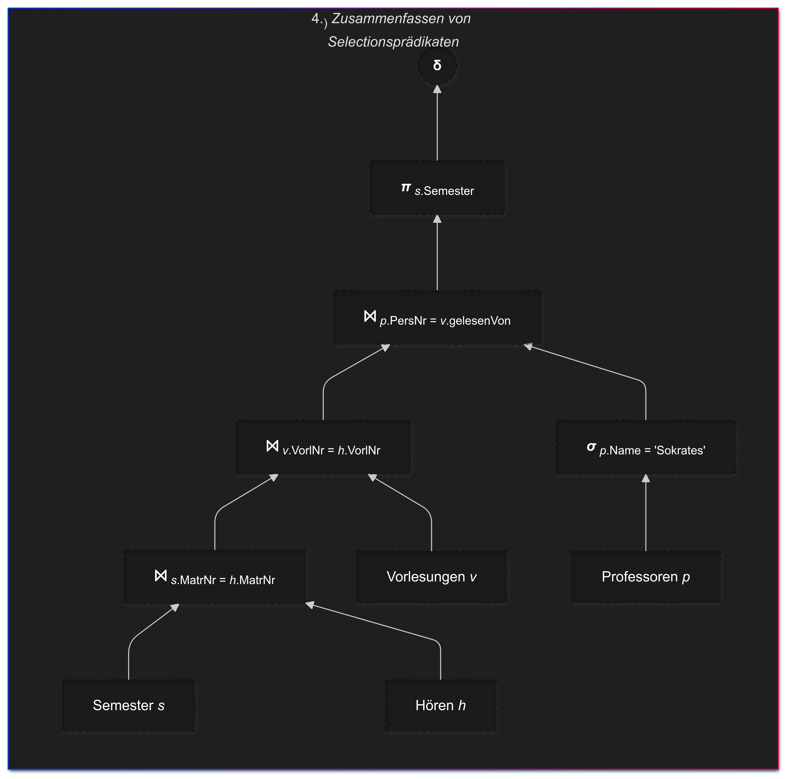
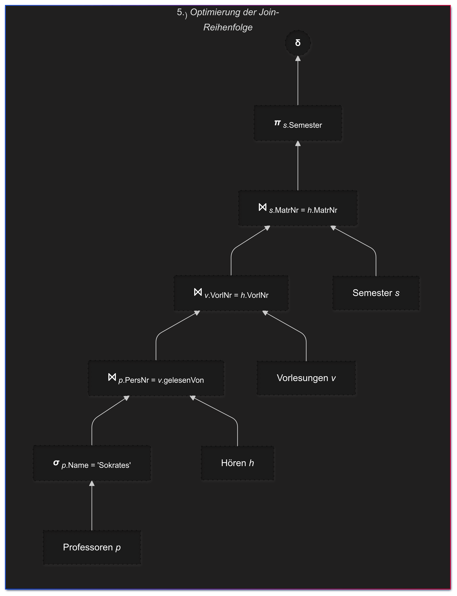
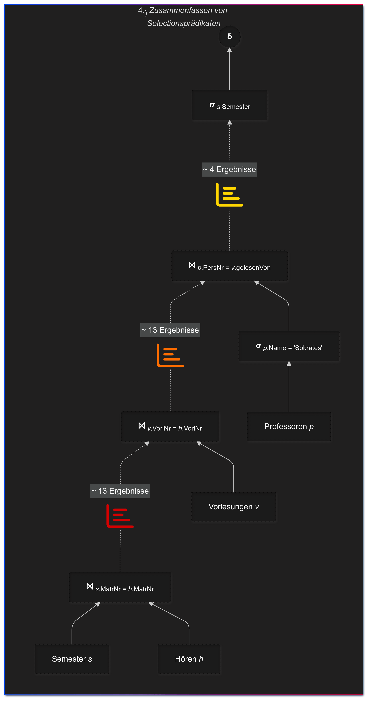
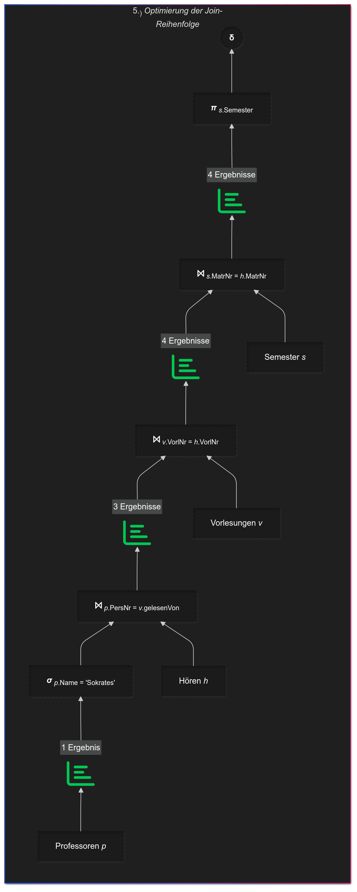

<!-- -->
 ## Logische Optimierung
 
 |  1  |  2  |  3  |  
 |:---:|:---:|:---:|  
 |  | |  |  
 |**4**|**5**|**6**|  
 |  |  |  |  
 | | | |  
 
---

### **Erhaltene Ergebnisse im Vergleich:**

 |  **4** | **5** |  
 |:------:|:-----:|  
 |  |  |  
 

