- *Beispiel:*
  > Gegeben sei die folgende SQL-Anfrage:
  > ```SQL
  > SELECT DISTINCT 
  >   a.PersNr , 
  >   a.Name
  > FROM 
  >   Assistenten a , 
  >   Studenten s , 
  >   pruefen p
  > WHERE 
  >       s.MatrNr = p.MatrNr
  >   AND a.Boss   = p.PersNr
  >   AND s.Name   = 'Jonas';
  > ```

---

- ### 1.)

```mermaid
flowchart BT
  0((**δ**))
  d(**𝜋** <sub> a.PersNr, a.Name</sub> )
  w(**σ** <sub>s.MartNr = p.MatrNr **AND**..</sub>)
  
%%  sJ[s.Name   = 'Jonas']
%%  ap[a.Boss   = p.PersNr]
%%  sp[s.MatrNr = p.MatrNr]

  x1((**X**))
  x0((**X**))
  
  a[Assistenten *a*]
  s[Studenten *s*]
  p[pruefen *p*]

  x1 --> w
  x0 --> x1
  s --> x0
  a --> x1
  p --> x0
  w --> d
  d --> 0
```

---
- ### 2.)

```mermaid
flowchart BT
  0((**δ**))
  d(**𝜋** <sub> a.PersNr, a.Name</sub> )
%%  w(**σ** <sub>s.MartNr = p.MatrNr **AND**..</sub>)
  
  sJ(**σ** <sub>s.Name   = 'Jonas'</sub>)
  ap(**σ** <sub>a.Boss   = p.PersNr</sub>)
  sp(**σ** <sub>s.MartNr = p.MatrNr</sub>)

  x1((**X**))
  x0((**X**))
  
  a[Assistenten *a*]
  s[Studenten *s*]
  p[pruefen *p*]

  x1 --> sJ
  sJ --> ap
  ap --> sp
  x0 --> x1
  s --> x0
  a --> x1
  p --> x0
  sp --> d
  d --> 0
```

---

- ### 3.)

```mermaid
flowchart BT
  0((**δ**))
  d(**𝜋** <sub> a.PersNr, a.Name</sub> )
  sJ(**σ** <sub>s.Name   = 'Jonas'</sub>)
  ap(**σ** <sub>a.Boss   = p.PersNr</sub>)
  sp(**σ** <sub>s.MartNr = p.MatrNr</sub>)
  a[Assistenten *a*]
  s[Studenten *s*]
  p[pruefen *p*]

  ap --> d 
  sJ --> sp
  sp --> ap
  a  --> ap
  p  --> sp
  s  --> sJ
  d  --> 0
```

---
