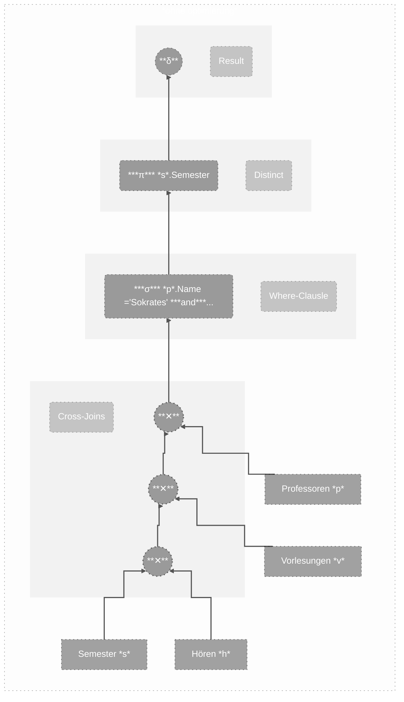

<!-- ## Logische Optimierung
-->

```mermaid
%%{init: { "flowchart": { "curve": "step" } } }%%

flowchart BT
  classDef steps fill:#00000002, stroke:#0000005a, stroke-width:1px, color:#fff, stroke-dasharray: 2 5;

  subgraph step0[ *ohne optimierung* ]
    direction BT
  classDef cross fill:#0000005d, stroke:#0000008a, stroke-width:2px, color:#fff, stroke-dasharray: 2 5;
  classDef node fill:#0000005d, stroke:#0000008a, stroke-width:1px, color:#fff, stroke-dasharray: 2 5;
  classDef sub fill:#0000000b, stroke:#ffffff0e, stroke-width:1px, color:#fff;
  classDef note fill:#00000031, stroke:#0000005a, stroke-width:1px, color:#fff, stroke-dasharray: 2 5;

  noteX
  0((**δ**))
  1(***π*** *s*.Semester )
  2(***σ*** *p*.Name ='Sokrates' ***and***... )
  p[Professoren *p*]
  s[Semester *s*]
  h[Hören *h*]
  v[Vorlesungen *v*]
   x((**✕**))
  x2((**✕**))
  x3((**✕**))
  
  class x,x2,x3 cross;
  class 0,1,2,p,v,s,h node;
  %% 0  
  1  --> 0        
  %% 1      
  2  --> 1        
  %% 2      
  x  --> 2        
  %% 3      
  x2 --> x        
  %% 4      
  x3 --> x2       
  %% 5      
  v  --> x2       
  %% 6      
  p  --> x        
  %% 7      
  s  --> x3       
  %% 8      
  h  --> x3       
  linkStyle 0,1,2,3,4,5,6,7,8 fill:none, stroke:#555, stroke-width:2px, color:white;
  
  
  subgraph sub0 [" "]
    0
    note( Result )
  end
  subgraph sub1 [" "]
    1
    note1( Distinct )
  end
  subgraph sub2 [" "]
    2
    note2( Where-Clausle )
  end
 
  subgraph subX [" "]
    noteX( Cross-Joins )
    x  
    x2
    x3
  end
  class sub0,sub1,sub2,subP,subV,subS,subH,subX sub;
  class note,note1,note2,noteH,noteS,noteV,noteP,noteX note;
end
class step0 steps;
```

|  | |
|:--:|:--:|

 
