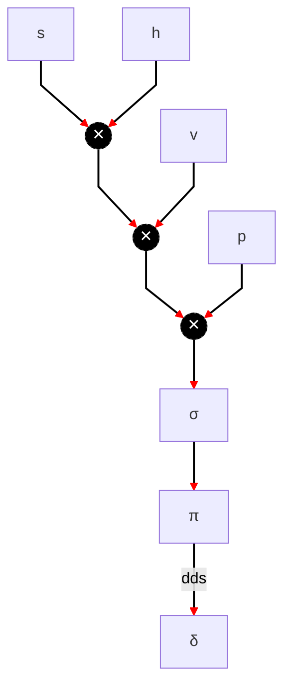

## Logische Optimierung

```mermaid
%%{init: { "flowchart": { "curve": "linear" } } }%%

flowchart TB
  classDef cross fill:#000,stroke:#ffffff4d,stroke-width:2px,color:#fff,stroke-dasharray: 2 4;
  
  0[δ]
  1[π]
  2[σ]
  x((✕))
  x2((✕))
  x3((✕))
  p[p]
  s[s]
  h[h]
  class x,x2,x3 cross;

  %% 0  
  1  -- dds --> 0        
  %% 1      
  2  --> 1        
  %% 2      
  x  --> 2        
  %% 3      
  x2 --> x        
  %% 4      
  x3 --> x2       
  %% 5      
  v  --> x2       
  %% 6      
  p  --> x        
  %% 7      
  s  --> x3       
  %% 8      
  h  --> x3       

  linkStyle 0,1,2,3,4,5,6,7,8 fill:none, stroke:#000, stroke-width:2px, color:black;
  linkStyle default stroke-width:2px,fill:none,stroke:red;

```

 
