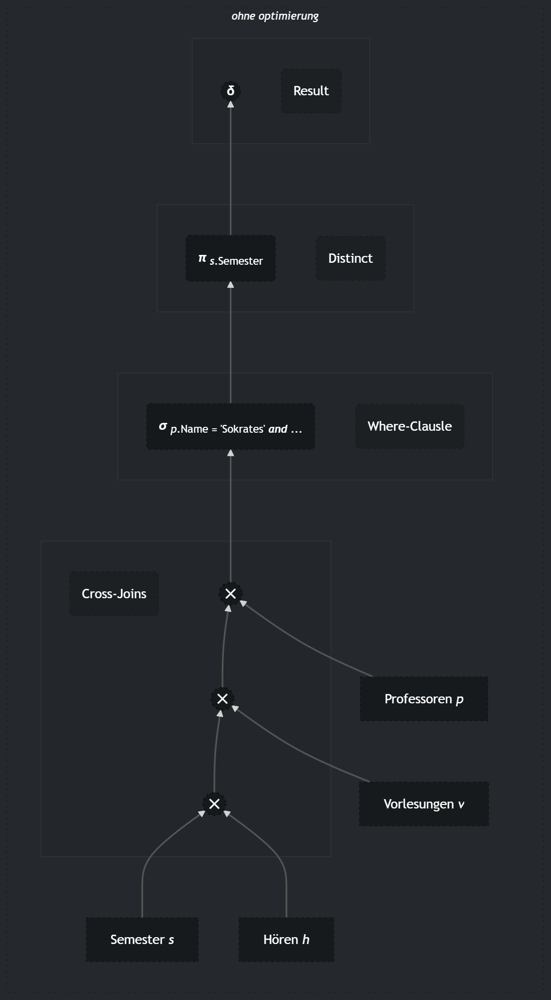
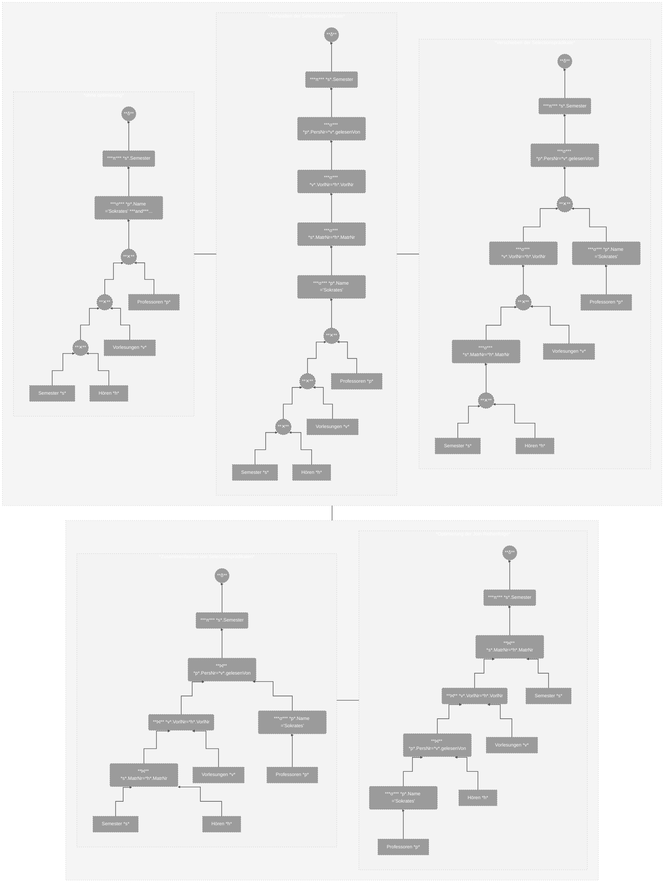

<!--
|  | |
|:--:|:--:|
-->

 ## Logische Optimierung

```mermaid
%%{init: { "flowchart": { "curve": "step" } } }%%

flowchart TB
%% ____________________________________________________________________________
  classDef steps fill:#00000002, stroke:#0000005a, stroke-width:1px, color:#fff, stroke-dasharray: 2 5;
  classDef cross fill:#0000005d, stroke:#0000008a, stroke-width:2px, color:#fff, stroke-dasharray: 2 5;
  classDef node fill:#0000005d, stroke:#0000008a, stroke-width:1px, color:#fff, stroke-dasharray: 2 5;
  classDef sub fill:#0000000b, stroke:#ffffff0e, stroke-width:1px, color:#fff;
  classDef OU  fill:#0000000a, stroke:#0000005a, stroke-width:1px, color:#fff, stroke-dasharray: 2 5;
subgraph O[  ]
    direction LR

  subgraph step0[ *ohne optimierung* ]
  %% __________________________________
    direction BT
  %% -------------------
    0((**δ**))
    1(***π*** *s*.Semester )
    2(***σ*** *p*.Name ='Sokrates' ***and***... )
    p[Professoren *p*]
    s[Semester *s*]
    h[Hören *h*]
    v[Vorlesungen *v*]
     x((**✕**))
    x2((**✕**))
    x3((**✕**))
    %% .........
    class x,x2,x3 cross;
    class 0,1,2,p,v,s,h node;
  %% -------------------
    1  --> 0
    2  --> 1
    x  --> 2
    x2 --> x
    x3 --> x2
    v  --> x2
    p  --> x
    s  --> x3
    h  --> x3
    %% .........
    linkStyle default fill:none, stroke:#555, stroke-width:2px, color:white;
  %% -------------------
    %%  subgraph sub0 [" "]
    %%    0
    %%    note( Result )
    %%  end
    %%  subgraph sub1 [" "]
    %%    1
    %%    note1( Distinct )
    %%  end
    %%  subgraph sub2 [" "]
    %%    2
    %%    note2( Where-Clausle )
    %%  end
    %%  subgraph subX [" "]
    %%    noteX( Cross-Joins )
    %%    x
    %%    x2
    %%    x3
    %%  end
    %%  class sub0,sub1,sub2,subP,subV,subS,subH,subX sub;
    %%  class note,note1,note2,noteH,noteS,noteV,noteP,noteX note;
  %% -------------------
  end

  subgraph step1[ *Aufspalten der Selectionsprädikate* ]
    direction BT
  %% __________________________________
    01((**δ**))
    11(***π*** *s*.Semester )
    21a(***σ*** *p*.PersNr=*v*.gelesenVon)
    21b(***σ*** *v*.VorlNr=*h*.VorlNr)
    21c(***σ*** *s*.MatrNr=*h*.MatrNr)
    21d(***σ*** *p*.Name ='Sokrates')
    p1[Professoren *p*]
    s1[Semester *s*]
    h1[Hören *h*]
    v1[Vorlesungen *v*]
    x_((**✕**))
    x2_((**✕**))
    x3_((**✕**))
    %% .........
    class x_,x2_,x3_ cross;
    class 01,11,21,p1,v1,s1,h1 node;
  %% -------------------
    11   --> 01
    21a  --> 11
    x_   --> 21d
    21b  --> 21a
    21c  --> 21b
    21d  --> 21c
    x2_  --> x_ 
    x3_  --> x2_
    v1   --> x2_
    p1   --> x_ 
    s1   --> x3_
    h1   --> x3_
  end
  %% __________________________________

subgraph step2[ *Verschieben der Selectionsprädikate* ]
    direction BT
  %% __________________________________
      02((**δ**))
      12(***π*** *s*.Semester )
      22a(***σ*** *p*.PersNr=*v*.gelesenVon)
      22b(***σ*** *v*.VorlNr=*h*.VorlNr)
      22c(***σ*** *s*.MatrNr=*h*.MatrNr)
      22d(***σ*** *p*.Name ='Sokrates')
      p2[Professoren *p*]
      s2[Semester *s*]
      h2[Hören *h*]
      v2[Vorlesungen *v*]
     x_2((**✕**))
    x2_2((**✕**))
    x3_2((**✕**))
    %% .........
    class x_2,x2_2,x3_2 cross;
  %% -------------------
      12  -->   02
      22a -->   12
     x_2  -->   22a
      22b -->   x_2
      22c -->   x2_2
      22d -->   x_2
    x2_2  -->  22b 
    x3_2  --> 22c
      v2  --> x2_2
      p2  -->  22d 
      s2  --> x3_2
      h2  --> x3_2
  end
  %% __________________________________

  step0 --- step1
  step1 --- step2
  class step0,step1,step2 steps;
end

subgraph U[ ]
  direction LR
%% ____________________________________________________________________________
subgraph step3[ *Zusammenfassen von Selectionsprädikaten* ]
    direction BT
  %% __________________________________
      03((**δ**))
      13(***π*** *s*.Semester )
      23a(**⨝** *p*.PersNr=*v*.gelesenVon)
      23b(**⨝** *v*.VorlNr=*h*.VorlNr)
      23c(**⨝** *s*.MatrNr=*h*.MatrNr)
      23d(***σ*** *p*.Name ='Sokrates')
      p3[Professoren *p*]
      s3[Semester *s*]
      h3[Hören *h*]
      v3[Vorlesungen *v*]
  %% -------------------
      13  --> 03
      23a --> 13
      23b --> 23a
      23c --> 23b
      23d --> 23a
      v3  --> 23b
      p3  --> 23d 
      s3  --> 23c
      h3  --> 23c
  end
  %% __________________________________

subgraph step4[ *Optimierung der Join-Reihenfolge* ]
    direction BT
  %% __________________________________
      04((**δ**))
      14(***π*** *s*.Semester )
      24a(**⨝** *p*.PersNr=*v*.gelesenVon)
      24b(**⨝** *v*.VorlNr=*h*.VorlNr)
      24c(**⨝** *s*.MatrNr=*h*.MatrNr)
      24d(***σ*** *p*.Name ='Sokrates')
      p4[Professoren *p*]
      s4[Semester *s*]
      h4[Hören *h*]
      v4[Vorlesungen *v*]
  %% -------------------
      14  --> 04
      24a --> 24b
      24b --> 24c
      24c --> 14
      24d --> 24a
      v4  --> 24b
      p4  --> 24d 
      s4  --> 24c
      h4  --> 24a
  end
  %% __________________________________
  
  step3 --- step4
  class step3,step4 steps;
  end
  O --- U
  class O,U OU
```
 
