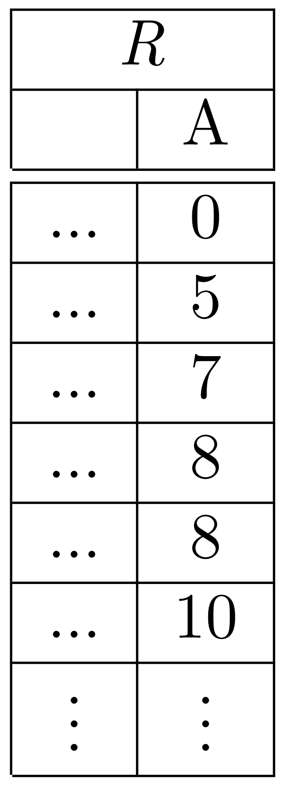

- ## Hausaufgabe 3

  - **a**) Was ist ein Equi-Join?
  - **b**) Bei welchen Join-Prädikaten `(<, =, >)` kann man sinnvoll einen Hashjoin einsetzen?
  - **c**) Gegeben ist die Relation *`Profs = {PersNr, Name}`* und *`Raeume = {PersNr, RaumNr}`*.
  
    - **1.** Skizzieren Sie eine geschickte Möglichkeit, den Equi-Join *`Profs ⨝ Raeume`* durchzufuhren.

    - **2.** In welchem Fall wäre selbst ein Ausdruck wie
       *`Profs ⨠Profs.Persnr < Raeume.PersNr Raeume`*
      effizient auswertbar?

  - **d**) Der Student Maier hat einen Algorithmus gefunden, 
    der den Ausdruck `A ⨉ B` in einer Laufzeit von `O( | A | )` materialisiert. 
    Was sagen Sie Herrn Maier?

    ---

  

    
 click 4

    $\Large\color{lime}{\ 👉🏼\ Lösung\ :\ }$ 
    

 
  - **a**)
    *Ein Equi-Join hat eine Aquivalenz als Joinbedingung, etwa die Gleichheit zweier Attribute.*
  
  - **b**) 
    *Ein Hash Join bietet sich nur fur Equi-Joins an, 
    da lediglich ein Join-Partner mit gleichem Attributwert effizient auffindbar ist.* 
    > Das Finden eines Partners, dessen Attributwert beispielsweise kleiner sein soll kann mittels Hashing i.A. nicht effizient bearbeitet werden.

  - **c**) 

    - **1.**) 
      *Offenbar ist das Joinattribut gerade der Primärschlussel, 
      womit von der Existenz eines Indexes ausgegangen werden kann. 
      Somit bietet sich ein Index-basierter Join an, etwa dadurch, 
      dass die eine Relation Element fur Element abgearbeitet wird, 
      während Joinpartner aus der anderen Relation mittels des Indexes gefunden werden.*

    - **2.**) 
      *Falls der Index sortiert ist, dies wäre etwa bei einem B-Baum der Fall. 
      Dadurch liegen Joinpartner zumindest nacheinander im Index, anders als bei einer Implementierung des Indexes mittels Hash.*

  - **d.**) 
    *Dies ist mit Sicherheit nicht der Fall,* 
    > da ein Algorithmus keine bessere Komplexitätsklasse haben kann als sein Ergebnis wächst. 

    *Mit anderen Worten, $\color{white}{A\ ⨉\ B}$ hat eine Ergebnisgröße von $\color{white}{|A|\ ∗\ |B|}$ und dieses Ergebnis kann sicher nicht schneller als in $\color{white}\large{O}\small{(|A|\ ∗\ |B|)}$ materialisiert werden.*

  

---

- ## Hausaufgabe 4
  - Gegeben sind die beiden Relationenausprägungen:
  
    

       |  |   |
       | -------------------------------------------------: | :-------------------------------------------------- |

    

  - **1.** Werten Sie den Join **R. ⨠R.A = S.B S** mithilfe des Nested-Loop- sowie des Sort/Merge-Algorithmus aus.  
    
  - **2.** Machen Sie deutlich, in welcher Reihenfolge die Tupel der beiden Relationen verglichen werden und kennzeichnen Sie die Tupel, die in die Ergebnismenge übernommen werden.

  - **3.** Vervollständigen Sie hierzu die beiden folgenden Tabellen:
    

      |  |   |
      | -------------------------------------------------: | :-------------------------------------------------- |

    

    ---

  
  

    
 click 4

    $\Large\color{lime}{\ 👉🏼\ Lösung\ :\ }$ 
    
  

    

     |  |   |
     | -------------------------------------------------: | :-------------------------------------------------- |
    

  

---
