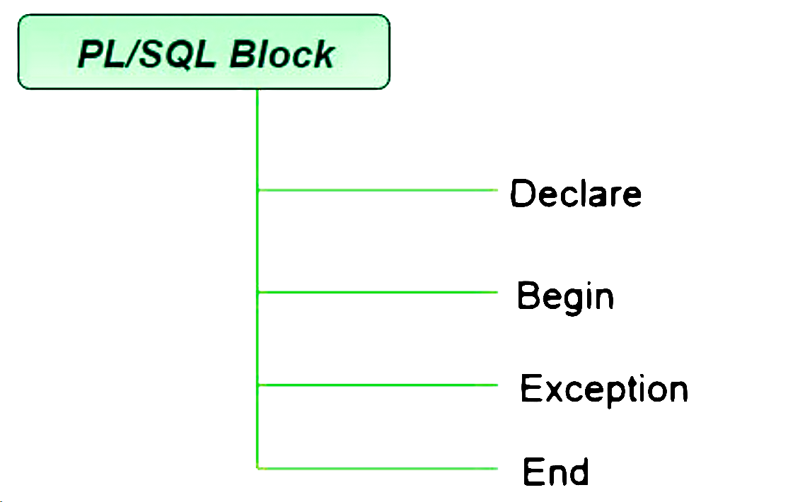

###### 
 PL - SQL 

  

 
# PL/SQL Introduction

PL/SQL (Procedural Language/Structured Query Language) is a block-structured language developed by Oracle that allows developers to combine the power of SQL with procedural programming constructs. The PL/SQL language enables efficient data manipulation and control-flow logic, all within the Oracle Database.

In this article, we’ll cover PL/SQL basics, including its core features, PL/SQL block structure, and practical examples that demonstrate the power of PL/SQL. We’ll also explore the differences between SQL and PL/SQL, how variables and identifiers work, and how the PL/SQL execution environment operates within Oracle.

## Basics of PL/SQL
  - PL/SQL stands for Procedural Language extensions to the Structured Query Language (SQL).
  - PL/SQL is a combination of SQL along with the procedural features of programming languages.
Oracle uses a PL/SQL engine to process the PL/SQL statements.
  - PL/SQL includes procedural language elements like conditions and loops. It allows declaration of constants and variables, procedures and functions, types and variable of those types and triggers.

## Features of PL/SQL
  - PL/SQL is basically a procedural language, which provides the functionality of decision-making, iteration, and many more features of procedural programming languages.
  - PL/SQL can execute a number of queries in one block using single command.
One can create a PL/SQL unit such as procedures, functions, packages, triggers, and types, which are stored in the database for reuse by applications.
  - PL/SQL provides a feature to handle the exception which occurs in PL/SQL block known as exception handling block.
Applications written in PL/SQL are portable to computer hardware or operating system where Oracle is operational.
  - PL/SQL Offers extensive error checking.

## Differences Between SQL and PL/SQL

  | SQL	| PL/SQL |  
  |:----|:-------|  
  | SQL is a single query that is used to perform DML and DDL operations.	| PL/SQL is a block of codes that used to write the entire program blocks/ procedure/ function, etc. |
  | It is declarative, that defines what needs to be done, rather than how things need to be done.	| PL/SQL is procedural that defines how the things needs to be done. |
  | Execute as a single statement.	| Execute as a whole block. |
  | Mainly used to manipulate data.	| Mainly used to create an application. |
  | Cannot contain PL/SQL code in it. |	It is an extension of SQL, so it can contain SQL inside it. |

## Structure of PL/SQL Block
PL/SQL extends SQL by adding constructs found in procedural languages, resulting in a structural language that is more powerful than SQL. The basic unit in PL/SQL is a block. All PL/SQL programs are made up of blocks, which can be nested within each other.

  

