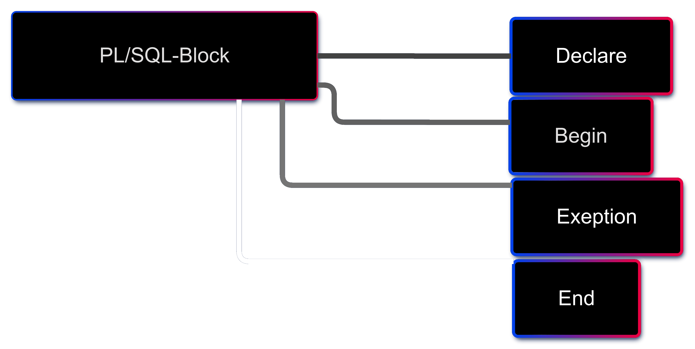

###### <p align="center"> PL - SQL </p>

<div align="center">

  

</div>
 
# PL/SQL Introduction


PL/SQL (Procedural Language/Structured Query Language) is a block-structured language developed by Oracle that allows developers to combine the power of SQL with procedural programming constructs. The PL/SQL language enables efficient data manipulation and control-flow logic, all within the Oracle Database.

In this article, we’ll cover PL/SQL basics, including its core features, PL/SQL block structure, and practical examples that demonstrate the power of PL/SQL. We’ll also explore the differences between SQL and PL/SQL, how variables and identifiers work, and how the PL/SQL execution environment operates within Oracle.

## Basics of PL/SQL
  - PL/SQL stands for Procedural Language extensions to the Structured Query Language (SQL).
  - PL/SQL is a combination of SQL along with the procedural features of programming languages.
Oracle uses a PL/SQL engine to process the PL/SQL statements.
  - PL/SQL includes procedural language elements like conditions and loops. It allows declaration of constants and variables, procedures and functions, types and variable of those types and triggers.

## Features of PL/SQL
  - PL/SQL is basically a procedural language, which provides the functionality of decision-making, iteration, and many more features of procedural programming languages.
  - PL/SQL can execute a number of queries in one block using single command.
One can create a PL/SQL unit such as procedures, functions, packages, triggers, and types, which are stored in the database for reuse by applications.
  - PL/SQL provides a feature to handle the exception which occurs in PL/SQL block known as exception handling block.
Applications written in PL/SQL are portable to computer hardware or operating system where Oracle is operational.
  - PL/SQL Offers extensive error checking.

## Differences Between SQL and PL/SQL

<div align="center">

  | SQL	| PL/SQL |  
  |:----|:-------|  
  | SQL is a single query that is used to perform DML and DDL operations.	| PL/SQL is a block of codes that used to write the entire program blocks/ procedure/ function, etc. |
  | It is declarative, that defines what needs to be done, rather than how things need to be done.	| PL/SQL is procedural that defines how the things needs to be done. |
  | Execute as a single statement.	| Execute as a whole block. |
  | Mainly used to manipulate data.	| Mainly used to create an application. |
  | Cannot contain PL/SQL code in it. |	It is an extension of SQL, so it can contain SQL inside it. |
</div>


## Structure of PL/SQL Block
PL/SQL extends SQL by adding constructs found in procedural languages, resulting in a structural language that is more powerful than SQL. The basic unit in PL/SQL is a block. All PL/SQL programs are made up of blocks, which can be nested within each other.

<div align="center">

  

</div>

  > A block has the following structure:
  >   ```SQL
  >   DECLARE
  >       declaration statements;
  > 
  >   BEGIN
  >       executable statements
  > 
  >   EXCEPTIONS
  >       exception handling statements
  > 
  >   END;
  >   ```

- Declare section starts with DECLARE keyword in which variables, constants, records as cursors can be declared which stores data temporarily. It basically consists definition of PL/SQL identifiers. This part of the code is optional.
- Execution section starts with BEGIN and ends with END keyword.This is a mandatory section and here the program logic is written to perform any task like loops and conditional statements. It supports all DML commands, DDL commands and SQL*PLUS built-in functions as well.
- Exception section starts with EXCEPTION keyword.This section is optional which contains statements that are executed when a run-time error occurs. Any exceptions can be handled in this section.

---

PL/SQL Identifiers
There are several PL/SQL identifiers such as variables, constants, procedures, cursors, triggers etc.

Variables: Like several other programming languages, variables in PL/SQL must be declared prior to its use. They should have a valid name and data type as well. Syntax for declaration of variables:

```SQL
variable_name datatype [NOT NULL := value ];
```

- Example to show how to declare variables in PL/SQL : 
  ```SQL
  SQL> SET SERVEROUTPUT ON;
  
  SQL> DECLARE
      var1 INTEGER;
      var2 REAL;
      var3 varchar2(20) ;
  
  BEGIN
      null;
  END;
  ```

- Output:

      PL/SQL procedure successfully completed.

- Explanation:

  - `SET SERVEROUTPUT ON`: It is used to display the buffer used by the dbms_output.

  - `var1 INTEGER` : It is the declaration of variable, named var1 which is of integer type. There are many other data types that can be used like float, int, real, smallint, long etc. It also supports variables used in SQL as well like NUMBER(prec, scale), varchar, varchar2 etc.

  - `PL/SQL procedure successfully completed.`: It is displayed when the code is compiled and executed successfully.

  - Assignment operator (`:=`) : It is used to assign a value to a variable.

- Displaying Output: 
  The outputs are displayed by using `DBMS_OUTPUT` which is a built-in package that enables the user to display output, debugging information, and send messages from PL/SQL blocks, subprograms, packages, and triggers. 
  <br>
  Let us see an example to see how to display a message using PL/SQL : 

  ```SQL
  SQL> SET SERVEROUTPUT ON;
  SQL> DECLARE
       var varchar2(40) := 'I love GeeksForGeeks' ;
  
    BEGIN
       dbms_output.put_line(var);
  
    END;
  ```

- Output:
    
        I love GeeksForGeeks
    
        PL/SQL procedure successfully completed.

- Explanation:
  
  - `dbms_output.put_line` : This command is used to direct the PL/SQL output to a screen.

- Using Comments: Like in many other programming languages, in PL/SQL also, comments can be put within the code which has no effect in the code. There are two syntaxes to create comments in PL/SQL :
  
  - Single Line Comment: To create a single line comment , the symbol – – is used.
  
  - Multi Line Comment: To create comments that span over several lines, the symbol /* and */ is used.
  
- Taking input from user: Just like in other programming languages, in PL/SQL also, we can take input from the user and store it in a variable. Let us see an example to show how to take input from users in PL/SQL: 

  ```SQL
  SQL> SET SERVEROUTPUT ON;
  
  SQL> DECLARE
  
        -- taking input for variable a
        a number := &amp;a;       

        -- taking input for variable b
        b varchar2(30) := &amp;b;     
  
    BEGIN
        null;
  
    END;
    ```

- Output:

      Enter value for a: 24
      old   2: a number := &a;
      new   2: a number := 24;
      Enter value for b: 'GeeksForGeeks'
      old   3: b varchar2(30) := &b;
      new   3: b varchar2(30) := 'GeeksForGeeks';

      PL/SQL procedure successfully completed.

  (***) Let us see an example on PL/SQL to demonstrate all above concepts in one single block of code. 
  
  --PL/SQL code to print sum of two numbers taken from the user.

  ```SQL
  SQL> SET SERVEROUTPUT ON;
  
  SQL> DECLARE

       -- taking input for variable a
       a integer := &a ; 

       -- taking input for variable b
       b integer := &b ; 
       c integer ;
  
    BEGIN
       c := a + b ;
       dbms_output.put_line('Sum of '||a||' and '||b||' is = '||c);
  
    END;
  ```

      Enter value for a: 2
      Enter value for b: 3
      
      Sum of 2 and 3 is = 5
      
      PL/SQL procedure successfully completed.
